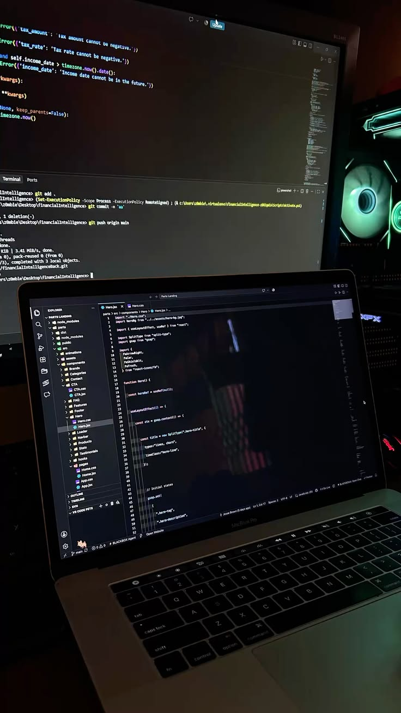

<div align="center">
  
</div>

---

<!--
<p align="left">
    
</p>
-->

<sub>🔴 &nbsp;🟡 &nbsp;🟢 &nbsp;&nbsp;&nbsp;&nbsp;&nbsp;&nbsp;&nbsp;&nbsp;&nbsp;&nbsp;&nbsp;&nbsp;&nbsp;&nbsp;&nbsp;&nbsp;&nbsp;&nbsp;&nbsp;&nbsp;&nbsp;&nbsp;&nbsp;&nbsp;&nbsp;&nbsp;&nbsp;&nbsp;&nbsp;&nbsp;&nbsp;&nbsp;&nbsp;&nbsp;&nbsp;&nbsp;&nbsp;&nbsp;&nbsp;&nbsp;&nbsp;&nbsp;&nbsp;&nbsp;&nbsp;&nbsp;&nbsp;&nbsp;&nbsp;&nbsp;&nbsp;&nbsp;&nbsp;&nbsp;&nbsp;&nbsp;&nbsp;&nbsp;&nbsp;&nbsp;&nbsp;&nbsp;&nbsp;&nbsp;&nbsp;&nbsp;&nbsp;&nbsp;&nbsp;&nbsp;&nbsp;&nbsp;&nbsp;&nbsp;&nbsp;&nbsp;&nbsp;&nbsp;&nbsp;&nbsp;&nbsp;&nbsp;&nbsp;&nbsp;&nbsp;&nbsp;&nbsp;&nbsp;&nbsp;&nbsp;&nbsp;&nbsp;&nbsp;&nbsp;&nbsp;&nbsp;&nbsp;&nbsp;&nbsp;&nbsp;&nbsp;&nbsp;&nbsp;&nbsp;&nbsp;&nbsp;&nbsp;&nbsp;&nbsp;&nbsp;<b>jotadev27 — zsh — 96×24</b></sub>


```console
Last login: Wed Sep 3 09:12:04 on ttys000

jotadev27@macbook ~ % neofetch --profile

        .:'            OS:        macOS (Apple Silicon M3)
    __ :'__            Host:      MacBook Air
 .'`  `-'  ``.         Shell:     zsh
:          .-'         Role:      Data Analytics · Full Stack · Mobile Developer
:         :            Uptime:    always shipping
 :         `-;         Editor:    VS Code · Antigravity · Android Studio
  `.__.-.__.'          Status:    Operational [ready]

jotadev27@macbook ~ % _
```

---

<table>
  <tr>
    <td width="66%" valign="top">
      <h3>&gt; Hey there! I'm jotadev27 👋</h3>
      <p><strong>Data Analytics • Full Stack • Mobile Developer</strong></p>
      <p>
        Systems Engineer specialized in architecting resilient full-stack platforms, cross-platform mobile apps, and high-performance data pipelines. Passionate about turning complex problems into clean, scalable solutions.
      </p>
      <p>
        My core focus revolves around transforming raw business requirements into automated processes, scalable database structures, and analytical dashboards for strategic decision-making. I enjoy working across the entire lifecycle, from backend architecture to the data-driven insights that matter.
      </p>
      <pre><code>$ cat dev.config

role:     [Data Analytics, Full Stack, Mobile Developer]
stack:    [Python, SQL Server, Power BI, Kotlin, React, C#]
building: data pipelines · dashboards · mobile apps
status:   Open to Collaborate</code></pre>
    </td>
    <td width="34%" align="center" valign="middle">
      
    </td>
  </tr>
</table>

> *"The main activity of programming is not the origination of new independent programs, but in the integration, modification, and explanation of existing ones."*
> — **Terry Winograd**

---

<h3 align="left">🛠️ Tech Stack</h3>

<div align="center">

<br/>
&nbsp;<br/>
&nbsp;<br/>


</div>

---

<h3 align="left">⚡ GitHub Stats</h3>

<p align="center">
  
  
</p>

<p align="center">
  
</p>

---

<h3 align="left">📈 Statistics</h3>

<p align="center">
  
</p>

---

<h3 align="left">🐍 contribution snake</h3>

<div align="center">
  <picture>
    <source media="(prefers-color-scheme: dark)" srcset="https://raw.githubusercontent.com/jotadev27/jotadev27/output/github-contribution-grid-snake-dark.svg" />
    <source media="(prefers-color-scheme: light)" srcset="https://raw.githubusercontent.com/jotadev27/jotadev27/output/github-contribution-grid-snake.svg" />
    
  </picture>
</div>

---
```console
jotadev27@macbook ~ % exit

[Process completed]
```
